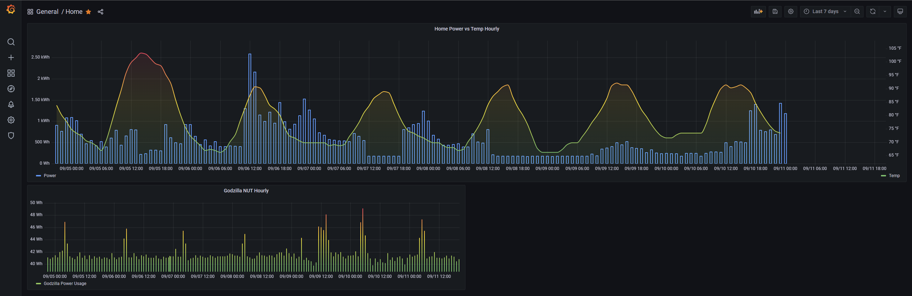
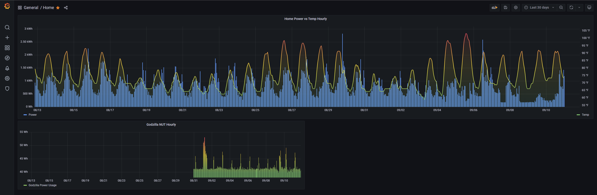
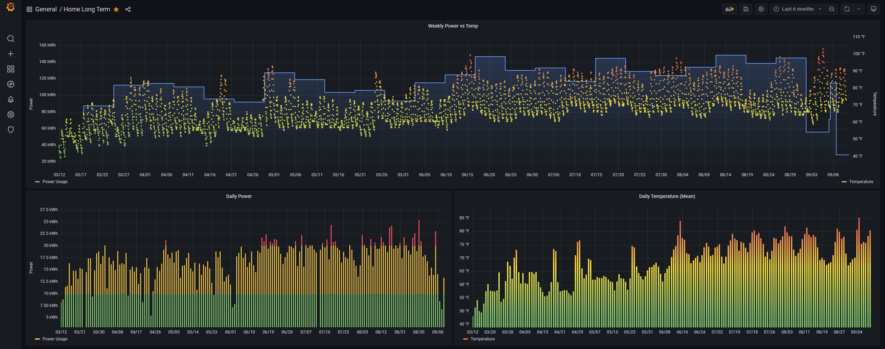
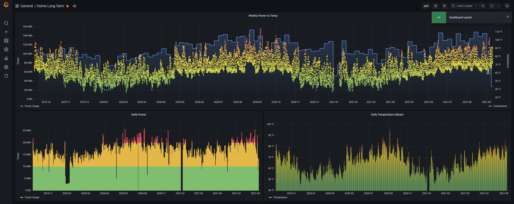

# homeflux
This project is a Python library to scrape measurements from various sources and plug them into an InfluxDB database. I
wrote this to store basic home metrics
(climate, power usage) in an InfluxDB database to output to a Grafana dashboard.

I started this project when I found that my utility provider (Glendale Water and Power) stores hourly meter reads for
use on a power usage dashboard. I thought it would be a fun project to get this data into a database of my own to better
view and interpret it. This was my first time using `asyncio`, `pydantic`, InfluxDB, Grafana, `requests` sessions, and
many other python libraries and features. 

### Grafana Dashboard
I currently have some pretty basic dashboards' setup. I'm working on getting more sensors to have more interesting data
to look at.

#### Home 7 and 30 Day
The main Home dashboard currently shows hourly power vs outdoor ambient temperature along with hourly power usage for my
home server.

#### Home Long Term 6 and 24 Month
The Home Long Term dashboard contains the weekly power usage vs hourly outdoor ambient temperature along with daily
power (colored based on rate tiers) and outdoor daily ambient mean temperature.

## Structure

### Agents
`Agents` are the workers which scrape data and return the measurements in the form of `Records`. The agents on this
project are using `asyncio` methods for parallel processing and context managers to handle logging in and out.

### Records
A `Record` is a single data point which contains the timescale (minute, hour, week), the measurement time, and the
measurement value. They may also contain metadata such as unit, location, source, etc. These use `pydantic` models to
handle typing and follow an abstract base class to define basic expected functionality.

There are currently two types of records, `PowerRecord` is used to represent power usage in Watt/Hours
and `ClimateRecord` is used to represent climate measurements. `ClimateRecord` currently only supports temperature but
should be easy to extend for humidity, rainfall, etc once I get more sensors for those measurements.

### Database
The `database` module provides basic support for adding `Records` to the InfluxDB database.

### Utils
I currently have just a few utilities in here, `Timer` is a basic timer class.
`db_utils` contains a few simple functions for creating/clearing buckets and seeding historical data.

### homeflux
`app.py` is the main point of entry and ties together the `Agents` and database. Also contains the basic `aiocron` event
loop used by the docker container.

`test.py` runs the (limited) unit tests.

`environment.py` is used to get environment variables.

`urls.py` stores the basic URL constants.
